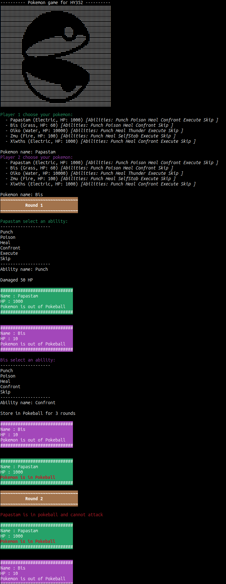
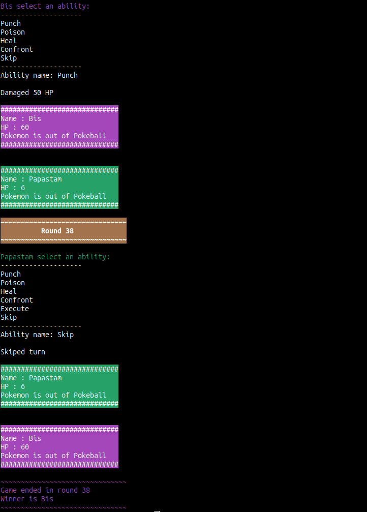

# Pokemon Simulation Language (HY352 Project)

## Table of Contents
- [Overview](#overview)
    - [Contributors](#contributors)
- [Language Syntax](#language-syntax)
    - [Game Creation](#game-creation)
    - [Pokemon Creation](#pokemon-creation)
    - [Ability Creation](#ability-creation)
    - [Ability Functions](#ability-functions)
        - [For loops](#for-loops)
        - [After Conditions](#after-conditions)
        - [If Conditions](#if-conditions)
        - [Conditions](#conditions)
    - [Ability Assignment](#ability-assignment)
    - [Printing](#printing)
- [Under the hood](#under-the-hood)
    - [Object Structure](#object-structure)
        - [Array\<T\>](#arrayt)
        - [Game](#game)
        - [Pokemon](#pokemon)
        - [Ability](#ability)
- [Running the game](#running-the-game)
    - [How to run](#how-to-run)
    - [Running the included testfile](#running-the-included-testfile)


## Overview
For the project of the course "Software Engineering" (HY-352) we created a programming language that simulates the Pokemon game. The language uses keywords for the creation of the pokemons, their abilities and the assignment of the abilities to pokemons. Using these keywords, the user can create a .cpp file that when executed (Assuming the `DUEL` keyword is present) it simulates a pokemon battle.

In the begining, each player chooses a pokemon to use, when that happens the pokemons come out of the pokeball and the battle begins. Each pokemon has a set of abilities that can be used by the player in each round. The game ends when one of the pokemons faints.

### Contributors
For the purpose of this project, we created teams of two. The team consisted of the following members:
- [Chris Papastamos](https://github.com/papastam)
- [Dimitris Bisias](https://github.com/dbisias)

## Language Syntax

### Game Creation
First of all, the game must be included in the `.cpp` file by including the [`inc/gramar.h`](inc/grammar.h) header file. Depending on the location of the file, the user can include the header file using the following syntax:
```c++
#include "inc/grammar.h"
```

The user can create a game using the following syntax:
```c++
BEGIN GAME
    <Game Content>
END_GAME
```
The game content can be any of the following:

### Pokemon Creation
The user can create a pokemon using the following syntax:
```c++
CREATE POKEMON{
    NAME: "<pokemon_name>"
    TYPE: "<pokemon_type>"
    HP: <pokemon_hp>
}
```
The user can also create multiple pokemons using the following syntax:
```c++
CREATE POKEMONS[
    Pokemon{
        NAME: "<pokemon1_name>"
        TYPE: "<pokemon1_type>"
        HP: <pokemon1_hp>
    },
    Pokemon{
        NAME: "<pokemon2_name>"
        TYPE: "<pokemon2_type>"
        HP: <pokemon2_hp>
    },
    ...
]
```
Some limitations exist:
- The `NAME` of each pokemon must be unique in the game and not longer than 20 characters. 
- The `TYPE` of each pokemon must be one of the following: 
    - `"Fire"` _Deal 20% more damage to "Electric" type pokemons and 15% more damage to all other types_
    - `"Water"` _Deal 7% more damage to all types and receive 7% less damage from all types_
    - `"Grass"` _Deal 7% more damage at every odd round and restore 5% of
    the initial HP at every even round_ 
    - `"Electric"` _Recieve 30% less damage from "Fire" type pokemons and 20% less damage from all other types_

### Ability Creation
The user can create an ability using the following syntax:
```c++
CREATE ABILITY{
    NAME: "<ability_name>"
    ACTION: START
        <Ability Funciton>
    END
}
```
The user can also create multiple abilities using the following syntax:
```c++
CREATE ABILITIES[
    Ability{
        NAME: "<ability1_name>"
        ACTION: START
            <Ability1 Funciton>
        END
    },
    Ability{
        NAME: "<ability2_name>"
        ACTION: START
            <Ability2 Funciton>
        END
    },
    ...
]
```
Like the Pokemons. ability names must be unique in the game and not longer than 20 characters.

### Ability Functions
Each ability is a function that can be used by the player in each round. 

Inside the function, the attacker and the defender at the time of the function execution are represented by the keywords `ATTACKER` and `DEFENDER` respectively.

The function can be created using the following components:

- `DAMAGE <DEFENDER/ATTACKER> <amount>` _Deals \<amount\> damage to the <DEFENDER/ATTACKER>_
- `HEAL <DEFENDER/ATTACKER> <amount>` _Heals \<amount\> HP to the <DEFENDER/ATTACKER>_
- `POKEBALL <DEFENDER/ATTACKER> _` Puts the \<DEFENDER/ATTACKER\> back to its pokeball
- `POKEBALL <DEFENDER/ATTACKER> ---α` Takes the \<DEFENDER/ATTACKER\> out of its pokeball

#### For loops
The user can create a loop that executes a segment of code for a specified number of rounds. This reoccuring segment will be executed at the start of each round of the player that used the ability. The loop can be created using the following syntax:
```c++
FOR <rounds> ROUNDS DO
    <Function_secgment>
END
```
#### After Conditions
The user can create a pending action that will be executed after a specified number of rounds. The action can be created using the following syntax:
```c++
AFTER <rounds> ROUNDS DO
    <Function_secgment>
END
```

#### If Conditions
The user can create a conditional statement that will execute a segment of code if a condition is met. The condition can be created using the following syntax:
```c++
IF <condition> DO
    <Function_secgment>
END
```
The user can also create an if-else _(or if-elseif or if-elseif-else)_ statement using the following syntax:
```

IF <condition> DO
    <Function_secgment>
ELSE IF <condition> DO
    <Function_secgment>
ELSE
    <Function_secgment>
END
```

#### Conditions
In an if condition, the user can use the following accessors to access the pokemon's attributes:

- `GET_HP(<DEFENDER/ATTACKER>)` _Returns the HP of the \<DEFENDER/ATTACKER\>_
- `GET_TYPE(<DEFENDER/ATTACKER>)` _Returns the type of the \<DEFENDER/ATTACKER\>_
- `GET_NAME(<DEFENDER/ATTACKER>)` _Returns the name of the \<DEFENDER/ATTACKER\>_
- `IS_IN_POKEBALL(<DEFENDER/ATTACKER>)` _Returns true if the \<DEFENDER/ATTACKER\> is in its pokeball_

Comparisons between arithmetic of string values are also supported. The user can use the following operators:

- `==` _Checks if the two values are equal_
- `!=` _Checks if the two values are not equal_
- `>` _Checks if the first value is greater than the second_
- `>=` _Checks if the first value is greater or equal than the second_
- `<` _Checks if the first value is less than the second_
- `<=` _Checks if the first value is less or equal than the second_

Logical operators are also supported. The user can compare boolean expressions using the following operators:

- `AND(x, y)` _Returns true if both x and y are true_
- `OR(x, y)` _Returns true if either x or y is true_

### Ability Assignment
The user can assign an ability to a pokemon using the following syntax:
```c++
DEAR "<pokemon_name>" LEARN[
    ABILITY_NAME("<ability1_name>"),
    ABILITY_NAME("<ability2_name>"),
    ...
    ABILITY_NAME("<abilityN_name>")
]
```

### Printing
The user can print a message using the following syntax:
```c++
SHOW "<message>"
```

## Under the hood
The language is mainly implemented using the C++ preprocessor. Using C++ defines and macros, we created a language that is compiled to C++ code. The preprocessor is used to replace the keywords with the appropriate C++ code. The C++ code is then compiled and executed.

Under the C++ macros the code uses objects to represent the game, the pokemons and their abilities. Many opperators of these objects (such as `+`, `-`, `+=`, `--`, `=`, `<<`, `,`and `[]`) were overloaded to achueve the desired keyword syntax.

### Object Structure
#### Array\<T\>
The `Array<T>` class is used to represent an array of objects of type `T`. The class contains an array of pointers to objects of type `T` and a `count` variable that represents the number of objects in the array. The insertion and deletion of objects in the array is done using the `.add()` and `.remove_and_rearrange()` functions respectively. The class also contains an overloaded `[]` operator that is used to access the objects in the array.

#### Game
The game object is represented by the `Game` class. The game object contains an [Array](#arrayt) of pokemons and an [Array](#arrayt) of abilities. 

Operators such as `+=` are overloaded to allow the user to add pokemons and abilities to the game. The `<<` operator is overloaded to allow the user to print messages. The `DUEL` part of the game also happens in the `.duel()` function.

#### Pokemon
The pokemon object is represented by the `Pokemon` class. The pokemon object contains a name, a type, an HP and an [Array](#arrayt) of abilities. Each pokemon also contains an [Array](#Arrayt) of pending/recuring actions that are executed after a specified number of rounds.

The `<<` operator is overloaded to allow the user to print messages. The `+` operator is overloaded to allow the user to heal/damage the pokemon and to preform Pokeball actions. The `+=` operator is overloaded to allow the user to add abilities to the pokemon. 


#### Ability
The ability object is represented by the `Ability` class. The ability object contains a name, and an action. The action is a lambda function that is executed when the ability is used. Also a count of the number of rounds that the ability has been used is stored and a count of the number of rounds that the ability has to wait to be activated.

The `<<` operator is overloaded to allow the user to print messages. The `+=` operator is overloaded to allow the language to assign a function to the ability after construction.

## Running the game
The user can start a duel using the `DUEL` KEYWORD. 

### How to run

After cloning the repository, you can create your own game senario by the following two methods:

#### Method 1
1. Edit the [`pokemon.cpp`](src/pokemon.cpp) and create your own game senario.
2. Run the `make` command in the [root directory](.):

#### Method 2
1. Create a new `.cpp` file and follow the [Language Syntax](#language-syntax) to create your own game senario.
2. Compile the game using the following command:
```bash
g++ -I inc --std=c++17 -Werror <your_file.cpp> -o <your__output_file>
```
3. Run the output file using the following command:
```bash
./<your__output_file>
```


### Running the included testfile
A run of the included testfile [`pokemon.cpp`](src/pokemon.cpp) will produce the following output:


_A few minutes later..._


